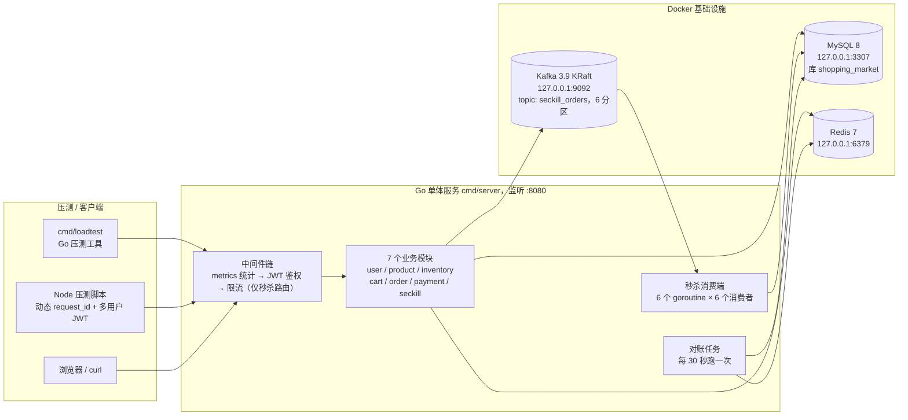
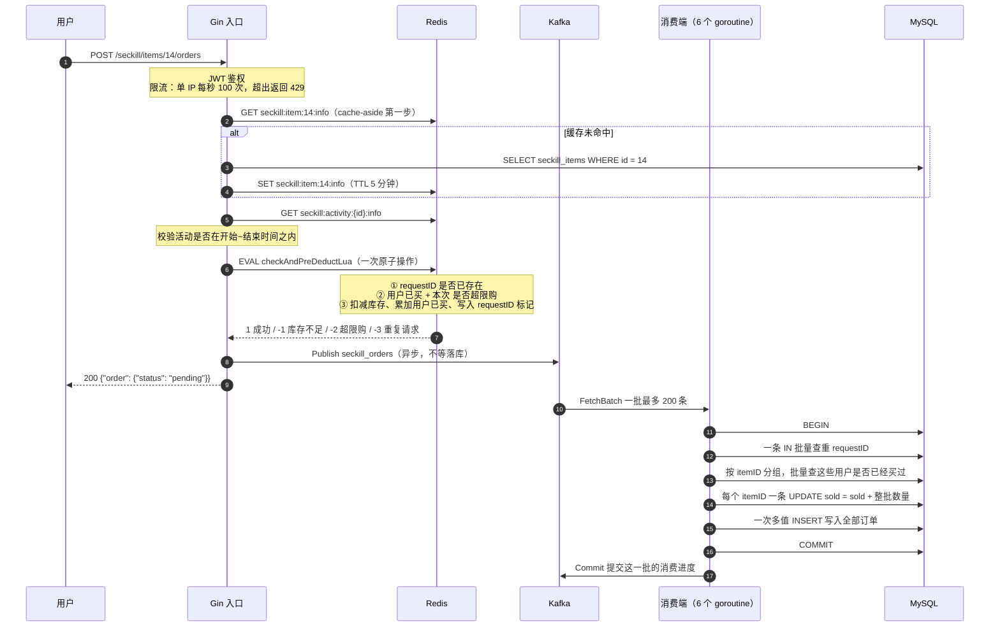
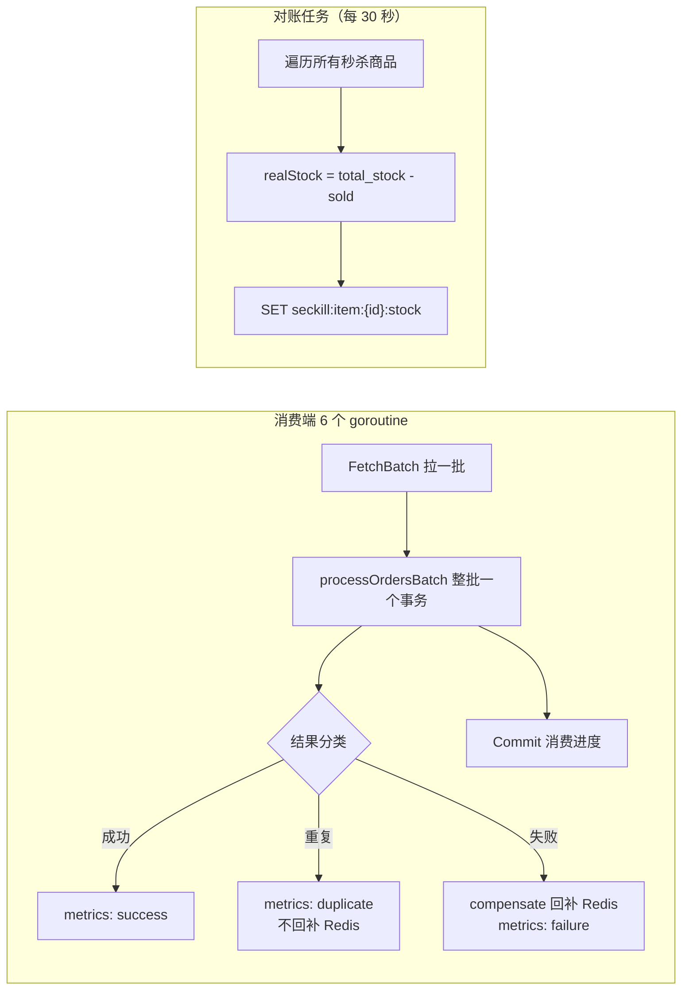

# 秒杀购物平台 · 架构说明

这份文档回答三个问题：**项目长什么样**、**一次秒杀请求从进来到落地经过了哪些地方**、
**每个零件各自负责什么**。

图用 Mermaid 画，在 GitHub、GitLab 或装了 Mermaid 插件的编辑器里能直接渲染成图；
纯文本阅读时也能看懂箭头方向。

## 1. 一句话介绍

这是一个 Go 写的网上商城**单体服务**。除了常规的「注册登录 → 逛商品 → 加购物车 → 下单 → 支付」，
额外做了一条**秒杀**链路：用 Redis 扛住瞬时流量、用 Kafka 把洪峰削平、用 MySQL 做最终的账本。

## 2. 整体部署图



**怎么读这张图**：客户端只跟 Go 服务打交道；Go 服务是所有逻辑的大脑；
MySQL、Redis、Kafka 是三个「外部帮手」，分别负责**存账本**、**顶流量**、**排队**。

## 3. 代码分层

```
cmd/
  server/        服务入口：装配所有模块、启动消费端和对账任务
  loadtest/      Go 压测工具
internal/
  user/          注册 / 登录 / JWT 鉴权
  product/       商品与 SKU
  inventory/     普通库存（非秒杀场景用）
  cart/          购物车
  order/         普通下单、支付 / 取消状态流转
  payment/       支付回调
  seckill/       秒杀（本项目重点）
  config/        配置读取
  pkg/           公共工具
    db/          MySQL 连接池
    redis/       Redis 客户端
    kafka/       Kafka 生产者 / 消费者封装
    jwt/         JWT 签发与校验
    metrics/     自研轻量指标（对外暴露 /metrics）
    ratelimit/   基于 Redis 的固定窗口限流
```

每个业务模块内部基本都是同一套「四件套」，看懂一个就会看懂全部：

| 文件 | 职责 | 打比方 |
| --- | --- | --- |
| `model.go` | 数据长什么样、对应哪张表 | 表格的列定义 |
| `repository.go` | 只跟数据库打交道，不含业务判断 | 仓库管理员 |
| `service.go` | 业务规则，决定「这件事能不能做」 | 店长 |
| `handler.go` + `router.go` | 解析 HTTP 请求、把结果写回响应 | 前台接待 |

这么做的好处：**换数据库只改 repository，改业务规则只改 service，改接口格式只改 handler**，
三个人的活互不打架，也方便以后拆成微服务（按模块直接切走就行）。

## 4. 秒杀主链路

### 4.1 时序图



### 4.2 关键点：用户拿到的 `pending` 是什么意思

接口返回 200 时，**订单还没有真正写进 MySQL**。用户拿到的是一张「排队凭证」：

- Redis 已经扣掉了库存，说明这个名额**确实留给他了**；
- 真正的订单由消费端稍后写入 MySQL，状态先是 `pending`；
- 因为 Redis 扣减成功就意味着「一定能落库」（除非数据库整个挂掉），
  所以对用户来说这个承诺是可信的。

这就是典型的**「先扣减、后落库」异步下单模型**，也是秒杀能扛住高并发的原因：
入口只做一次 Redis 调用 + 一次 Kafka 发送，不碰 MySQL 那台慢机器。

### 4.3 三层防线（面试重点）

| 层次 | 位置 | 挡住什么 | 靠什么实现 |
| --- | --- | --- | --- |
| 第一层 | Gin 限流中间件 | 挡住刷接口的机器流量 | Redis 固定窗口计数，单 IP 100 次/秒 |
| 第二层 | Redis Lua 脚本 | 挡住超卖、超限购、重复提交 | `checkAndPreDeductLuaScript` 一次原子完成三件事 |
| 第三层 | MySQL 条件更新 + 唯一索引 | 挡住前两层万一漏掉的情况 | `sold + N <= total_stock` 条件更新；`request_id`、`(item_id,user_id)` 唯一索引 |

前两层是**性能手段**（把流量挡在数据库之外），第三层是**正确性底线**（哪怕前面全出错，数据库也不会超卖）。
这个「性能与正确性分离」的思路，是秒杀设计里最值得讲的一点。

## 5. 秒杀模块文件分工

| 文件 | 负责什么 |
| --- | --- |
| `model.go` | `Activity`（活动）、`Item`（秒杀商品）、`Order`（秒杀订单）三个结构体 |
| `repository.go` | 单条与批量两套数据库方法：查商品、查活动、查重、扣库存、写订单 |
| `cache.go` | Redis 相关全部在这里：三个 Lua 脚本、cache-aside、库存对账写回 |
| `queue.go` | Kafka 消息结构 `OrderMessage`、发消息、批量拉取解析、批量提交 |
| `worker.go` | 消费端主循环 `consumeLoop`、整批落库 `processOrdersBatch`、失败补偿 `compensate` |
| `reconcile.go` | 定时对账：拿 MySQL 的 `sold` 重新算 Redis 库存并覆盖 |
| `service.go` | 秒杀入口 `Seckill`：校验参数 → 读缓存 → 校验活动时间 → Redis 预扣 → 发 Kafka |
| `handler.go` / `router.go` | HTTP 层与路由注册 |

## 6. Redis Key 设计

| Key 格式 | 含义 | 类型 | 有效期 | 谁写 |
| --- | --- | --- | --- | --- |
| `seckill:item:{itemID}:stock` | 剩余库存 | 整数 | 不过期 | Lua 预扣 / 对账覆盖 |
| `seckill:item:{itemID}:user:{userID}` | 该用户在该商品上已买数量 | 整数 | 不过期 | Lua 预扣 / 补偿回滚 |
| `seckill:request:{requestID}` | 幂等标记，存在即说明这个请求来过了 | 字符串 | 86400 秒 | Lua 预扣 |
| `seckill:item:{itemID}:info` | 商品信息缓存 | JSON | 5 分钟 | cache-aside 回源后写回 |
| `seckill:activity:{activityID}:info` | 活动信息缓存 | JSON | 5 分钟 | cache-aside 回源后写回 |
| `ratelimit:{维度}:{窗口号}` | 限流计数 | 整数 | 一个窗口 + 2 毫秒 | 限流中间件 |

注意 `:stock` 和 `:info` 是**两个不同的 key**，不能混用：
前者是随时在变的整数，后者是可以放心缓存 5 分钟的 JSON。

## 7. HTTP 接口清单

**无需登录**

| 方法 | 路径 | 作用 |
| --- | --- | --- |
| GET | `/health` | 健康检查，返回 `{"status":"ok"}` |
| GET | `/metrics` | 指标快照（见第 9 节） |
| POST | `/register` | 注册 |
| POST | `/login` | 登录，返回 JWT |
| POST | `/products` | 创建商品 |
| GET | `/products` | 商品列表 |
| GET | `/products/:id` | 商品详情 |
| DELETE | `/products/:id` | 删除商品 |
| POST | `/products/:id/skus` | 给商品加 SKU |
| POST | `/stocks` | 创建库存记录 |
| GET | `/stocks/:sku_id` | 查库存 |
| POST | `/stocks/:sku_id/deduct` | 扣库存 |

**需要登录（请求头带 `Authorization: Bearer <token>`）**

| 方法 | 路径 | 作用 |
| --- | --- | --- |
| POST / GET / PATCH / DELETE | `/cart/items`、`/cart/items/:item_id` | 购物车增删改查 |
| POST | `/orders` | 普通下单（带 `request_id` 做幂等） |
| GET | `/orders/:id` | 查订单 |
| POST | `/orders/:id/pay` | 支付订单 |
| POST | `/orders/:id/cancel` | 取消订单 |
| POST | `/payments/:order_id/callback` | 支付回调 |
| GET | `/payments/:order_id` | 查支付记录 |
| POST | `/seckill/activities` | 创建秒杀活动 |
| GET | `/seckill/activities` | 秒杀活动列表 |
| POST | `/seckill/activities/:id/items` | 给活动添加秒杀商品 |
| GET | `/seckill/activities/:id/items` | 查看活动下的秒杀商品 |
| POST | `/seckill/items/:item_id/orders` | **抢购（核心接口）** |

## 8. 后台任务

服务启动时会额外拉起两类后台工作，它们不在请求链路上，但保证最终正确性：



- **消费端**：负责把 Kafka 消息真正写进 MySQL；失败时把 Redis 预扣的库存还回去（补偿）。
- **对账任务**：兜底中的兜底。万一补偿也失败，30 秒内一定会用 MySQL 的账本把 Redis 修正回来。

`/metrics` 暴露的计数：`seckillRequests`、`seckillSuccess`、`seckillFailure`、
`seckillDuplicate`、`rateLimited`。

## 9. 环境与常用命令

| 组件 | 地址 | 说明 |
| --- | --- | --- |
| MySQL | `127.0.0.1:3307` | 用户 `root`，密码 `root`，库 `shopping_market` |
| Redis | `127.0.0.1:6379` | 无密码 |
| Kafka | `127.0.0.1:9092` | KRaft 单机模式，topic `seckill_orders` |
| HTTP 服务 | `:8080` | `cmd/server` |

```bash
make up                 # 启动 MySQL / Redis / Kafka
make run                # 启动服务
make kafka-partitions   # 把 seckill_orders 扩到 6 个分区
make kafka-lag          # 查看消费积压
make loadtest           # 跑压测
```

详细压测数据见 `docs/benchmark.md`。

## 10. 当前瓶颈与演进方向

**已经做到的**：消费端从约 80 条/秒提升到 1900+ 条/秒，Kafka 不再积压，
`sold`、订单数、去重用户数、Redis 剩余库存四者完全一致。

**还没做到的**：目标 1 万 QPS。目前 QPS 卡在约 1900，瓶颈**不在消费端**，
而在 HTTP 入口这一段（Redis Lua 往返 + Kafka 发送）以及压测客户端本身。

**如果以后要变微服务**，切分点已经天然存在：

| 服务 | 拆出去的边界 | 拆分后需要额外处理的事 |
| --- | --- | --- |
| 用户服务 | `internal/user` | JWT 校验要么下沉到网关，要么各服务共享公钥 |
| 商品 / 库存服务 | `internal/product`、`internal/inventory` | 库存归属唯一，避免两边同时改 |
| 订单服务 | `internal/order`、`internal/seckill` | 跨服务事务改用「本地消息表 + 最终一致」 |
| 支付服务 | `internal/payment` | 回调幂等、对账 |

拆分后的代价要提前想清楚：**分布式事务、链路追踪、服务发现、配置中心**都得补上，
所以现阶段保持单体是划算的——**先让单体跑满，再按真实瓶颈拆**，而不是一开始就拆。

## 11. 数据库选型对比（为什么是 MySQL）

面试常问「为什么用 MySQL」。下面按本项目的实际需求对比：

| 数据库 | 适合什么 | 放到这个项目里的好处 | 放到这个项目里的代价 |
| --- | --- | --- | --- |
| **MySQL 8**（当前选择） | 有事务、有强一致约束的关系型数据 | 唯一索引能直接兜住防重；条件更新 `sold + N <= total_stock` 一条 SQL 防超卖；生态成熟、面试官熟悉 | 单机写入有上限；高并发下同一行库存是热点 |
| PostgreSQL | 复杂查询、JSON、地理信息 | 约束更强（CHECK 约束能直接在库里校验库存非负），并发控制更细 | 本项目的瓶颈是「同一行的行锁竞争」，换 PG 也解决不了；团队与运维熟悉度通常不如 MySQL |
| MongoDB | 文档结构灵活、字段不固定 | 写订单这种半结构化数据方便 | **没有强事务和唯一索引兜底**，防重、防超卖要全靠应用层，风险大；本项目的核心恰恰是强一致 |
| Redis | 内存级读写、极高吞吐 | 本项目已经在用它做预扣和限流，单机轻松十万级 QPS | 内存贵、掉电可能丢数据；**不适合当唯一账本**，所以只让它做「预扣」而不是「记账」 |
| TiDB / OceanBase | 数据量大到单机 MySQL 扛不住，要做水平扩展 | 分布式事务 + 兼容 MySQL 协议，理论上能平滑替换 | 本机单机跑起来重，且当前 1 万 QPS 的量级用不上；**属于「以后真需要再上」的方案** |

**结论**：这个项目的核心诉求是**「不超卖、不重复、账目对得上」**，
这类强一致需求必须由关系型数据库 + 事务 + 唯一索引来保证，所以选 MySQL。
Redis 不是替代 MySQL，而是**站在 MySQL 前面当挡箭牌**：
把 99% 的无效流量挡掉，只把真正成交的那部分交给 MySQL。

**真正该问的不是「换哪个数据库」，而是「怎么让 MySQL 少干活」**——
这正是本项目优化的主线：入口不查 MySQL → MySQL 批量落库 → 一次事务处理 200 条消息。
