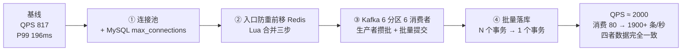

# 秒杀购物平台 · 面试讲解稿

这份稿子的用法：**先背第 1、2 节的框架，再背第 5 节的数字，最后看第 6 节的追问准备**。
第 6 节是面试官最可能深挖的地方，建议对着镜子讲一遍。

## 1. 开场：90 秒讲完项目

> 我做的是一个 Go 语言的电商单体服务，重点做**秒杀**这个高并发场景。
>
> 整体是「注册登录 → 商品 → 购物车 → 下单 → 支付」的常规电商链路，
> 秒杀作为独立页面单独设计。技术栈是 Gin + GORM + MySQL + Redis + Kafka。
>
> 秒杀的核心思路是**把流量挡在数据库外面**：
> 请求进来先在 Redis 里用一段 Lua 脚本原子地完成「请求去重 + 用户限购 + 库存预扣」，
> 扣到了就立刻返回成功并把消息发到 Kafka，真正写 MySQL 的动作交给后台消费端异步做。
>
> 这样 MySQL 就不会被瞬时流量打穿。我做过四轮优化，
> 消费端吞吐从最初约 **80 条/秒** 提升到 **1900 条/秒以上**，
> 最终压测下 QPS 约 2000、成本全 200、零错误，Kafka 零积压，
> 并且压到最后 `sold`、订单数、去重用户数、Redis 剩余库存四者完全对得上，没有超卖也没有重复购买。

如果面试官说「展开讲讲」，就进入第 2 节。

## 2. 架构和请求全流程

完整架构图见 `docs/architecture.md`，口头只需要讲这条主线：

```
用户 → Gin(鉴权+限流) → Redis(Lua 原子预扣) → Kafka(削峰排队) → 消费端 → MySQL(最终落库)
                            ↑                                              ↓
                            └────────── 对账任务每 30 秒兜底 ←──────────────┘
```

展开成 6 步：

1. **鉴权**：JWT 解析出 `user_id`，没登录直接 401。
2. **限流**：秒杀路由单独加了一层 Redis 固定窗口限流，单 IP 每秒 100 次，超出返回 429。
   目的是挡住脚本刷接口，不在后面几步浪费资源。
3. **读缓存**：商品和活动信息走 cache-aside，先查 Redis，未命中才回源 MySQL 并写回，TTL 5 分钟。
   高峰期绝大多数请求不再查库。
4. **原子预扣**：一段 Lua 脚本在 Redis 里一次做完三件事——
   判断 `request_id` 是否来过、判断该用户是否超限购、扣库存 + 记录用户已买数量。
   **这是整个系统最关键的一步**，因为 Lua 在 Redis 里是单线程原子执行的，
   天然避免「先查后扣」被并发请求插队导致的超卖。
5. **异步落库**：预扣成功后把消息发到 Kafka 就立刻返回 200，用户拿到一个 `pending` 状态的订单。
   此时 MySQL 里还没有这条记录。
6. **消费端落库**：6 个消费者 goroutine 从 Kafka 批量拉消息，一批最多 200 条，
   在**一个事务**里完成批量查重、批量查限购、按商品汇总扣库存、批量插订单，然后提交消费进度。

## 3. 核心设计点（面试官最想听的四个）

### 3.1 怎么保证不超卖

三层防线，性能和正确性分离：

| 层次 | 手段 | 性质 |
| --- | --- | --- |
| Redis Lua | `stock < quantity` 判断后才 `DECRBY`，判断和扣减在同一次原子操作里 | 性能手段 |
| MySQL 条件更新 | `UPDATE ... SET sold = sold + N WHERE id = ? AND sold + N <= total_stock` | 正确性底线 |
| MySQL 唯一索引 | `request_id` 唯一、`(item_id, user_id)` 唯一 | 正确性底线 |

**关键话术**：前两层是「让大部分请求根本到不了数据库」，
第三层是「就算前面全失效，数据库也绝不会写错」。这两件事必须分开设计，
不能指望数据库又能扛并发又不出错。

### 3.2 怎么保证幂等（同一请求不重复下单）

- **入口层**：`request_id` 在 Redis 里存一个标记（TTL 24 小时），
  存在就直接返回「重复的 request_id」，不再往下走。
- **落库层**：MySQL `seckill_orders.request_id` 是唯一索引，
  即使 Redis 标记因为某种原因丢了，重复插入也会被数据库拒绝。
- **批内去重**：同一批 Kafka 消息里如果出现相同的 `request_id`，
  在处理前就判成重复，避免撞唯一索引导致**整批**插入失败。

三层环环相扣，任何一层单独失效都不会出错。

### 3.3 怎么保证消息不丢、不重复

- **不丢**：消费端严格「先处理业务、再 `Commit` 消费进度」。
  如果先提交再处理，进程一崩消息就真丢了；反过来最多是重复消费一次，而重复是幂等的。
- **不重复造成错误**：重复消息落到 MySQL 会被唯一索引挡住，
  消费端把它归类成 `duplicate`。
  **注意：重复消息绝对不能回补 Redis**——它代表 MySQL 里已经有这条订单，
  说明当初那次扣减是真实成交的，再回补一次库存就凭空多出来，等于超卖。
- **兜底**：整批落库失败时，`compensate` 会把 Redis 预扣的库存和用户购买数还回去；
  万一补偿也失败，还有 30 秒一次的对账任务用 MySQL 的账本把 Redis 覆盖回正确值。

### 3.4 为什么用 Kafka，不用别的消息队列

| 对比项 | Kafka（当前选择） | RabbitMQ | Redis List / Stream |
| --- | --- | --- | --- |
| 吞吐 | 单机十万级，天然支持高吞吐 | 万级，更擅长复杂路由 | 十万级但功能少 |
| 顺序性 | **按分区保证顺序**，可以按 `itemID` 做 key 让同一商品的请求进同一分区 | 队列内顺序，但并发消费时顺序难保 | 顺序可控但要做很多自己实现 |
| 持久化 | 磁盘顺序写，可重复消费（改 offset） | 支持，但堆积能力弱 | Redis 是内存，堆积有风险 |
| 水平扩展 | **加分区就能加并行度**，这正是本项目消费端从 1 个消费者扩到 6 个的关键 | 加消费者即可，但单队列上限受限 | 需要自己分片 |
| 适合场景 | 削峰、日志、流式 | 业务解耦、延时队列、复杂路由 | 简单队列 |

**为什么这个项目选 Kafka**：秒杀的特征是**瞬时洪峰 + 短时间大量消息**，
需要「能存住、能堆积、能加消费者并行追」。
卡夫卡的分区模型正好能让 6 个消费者并行消费同一个 topic，
这是本项目消费端吞吐能提升 20 倍以上的结构性前提。

## 4. 优化故事（这是最加分的部分）

不要把优化讲成「我调了几个参数」，要讲成**「我不断找到当前真正的瓶颈并解决它」**：



### 第 ① 轮：先把「连接被打爆」解决掉

- **现象**：并发一上到 500 就开始出现 500，日志里是 `dial tcp 127.0.0.1:3307: connect: connection refused`。
- **原因**：GORM 没设连接池上限，MySQL 默认 `max_connections` 只有 151，连接一多直接被拒。
- **做法**：`SetMaxOpenConns(100)`、`SetMaxIdleConns(50)`、`SetConnMaxLifetime(1h)`，同时把 MySQL 提到 500。
- **结果**：连接拒绝消失，c=100 时 QPS 从 817 提升到 1116。
- **但**：c 继续加到 1000，QPS 反而降了、延迟涨到 1.3 秒——说明瓶颈转移了。

### 第 ② 轮：把数据库从入口链路上「请出去」

- **现象**：连接池打满，但慢查询一个都没有；一查代码发现秒杀入口在 Redis 之前先查了两次 MySQL
  （一次查 `request_id` 是否重复，一次查用户是否买过）。
- **原因**：这两次查询在秒杀场景下是纯浪费——Redis 里明明可以判。
- **做法**：把「请求去重 + 限购判断 + 库存预扣」合并成一段 Lua 脚本，一次 Redis 往返全部搞定。
- **结果**：c=100 时 QPS 从 1116 提升到 1445（+30%），c=500 时从 1698 到 2101。
- **注意点**：合并成一次原子操作还有个额外好处——**避免「先查后扣」之间被并发请求插队导致的超卖**。

### 第 ③ 轮：加并行度（Kafka 侧）

- **现象**：入口不查库了，但活动一结束还是有一堆消息积压，消费追不上。
- **原因**：只有 1 个消费者、1 个分区，而且生产者一条一条发、消费端一条一条提交，
  网络往返次数太多。
- **做法**：
  - topic 从 1 个分区扩到 **6 个分区**，启动 **6 个消费者**（同一个消费组）；
  - 生产者开启攒批：`BatchSize=100`、`BatchTimeout=10ms`；
  - 消费端改成 `FetchBatch` 批量拉、批量 `Commit`；
  - 关键细节：把 `CommitInterval` 设成 0 **关掉后台自动提交**，改成业务处理成功后手动提交，
    否则会出现「消息还没处理，offset 已经被自动提交了」的丢消息风险。
- **结果**：消费端吞吐上来了，Kafka 不再持续积压。

### 第 ④ 轮：批量落库（本轮重点，也是最能体现深度的一轮）

- **现象**：Kafka 侧优化完，消费速率还是只有约 **80 条/秒**。查监控发现
  `Innodb_row_lock_waits` 几乎等于 `Com_commit`——**每次提交都在等行锁**，
  平均每次等 **65 毫秒**。
- **原因**：**一条消息一个事务**，而 6 个消费者处理的都是同一个商品，
  每个事务里都有一句 `UPDATE seckill_items SET sold = sold + 1 WHERE id = ?`。
  MySQL 对同一行同一时刻只允许一个事务修改，于是 6 条流水线全挤在一个收银台前排队。
  **瓶颈从 Kafka 转移到了 MySQL 的行锁上。**
- **做法**：把「N 条消息 = N 个事务」改成「**N 条消息 = 1 个事务**」：

| 原来（每条消息各来一次） | 现在（整批一次） |
| --- | --- |
| N 次 `SELECT ... WHERE request_id = ?` | 1 次 `WHERE request_id IN (...)` |
| N 次 `SELECT ... WHERE user_id = ? AND item_id = ?` | 每个 itemID 一次 `IN (...)` |
| N 次 `UPDATE ... SET sold = sold + 1` | 每个 itemID 一次 `SET sold = sold + N` |
| N 次单条 `INSERT` | 1 次多值 `INSERT ... VALUES (...),(...)` |
| N 次行锁竞争 | **1 次行锁竞争** |

- **结果**（15379 条消息的一轮压测）：

| 指标 | 优化前 | 优化后 |
| --- | --- | --- |
| `Com_commit` 事务提交次数 | 1057 次 / 1057 条消息 | **196 次 / 15379 条消息**（约 78 条/事务） |
| `Innodb_row_lock_waits` 行锁等待 | 1057 | **90** |
| 消费速率 | 约 80 条/秒 | **1900+ 条/秒** |

- **额外踩到的坑**：批量插入时，同一批里如果有两条相同的 `request_id`，
  会撞唯一索引导致**整批**插入失败回滚。所以在处理前先做了一次「批内去重」，
  把同批重复的请求提前判成 `duplicate`。

### 四轮优化总览

| 轮次 | 瓶颈 | 解决手段 | QPS |
| --- | --- | --- | --- |
| 基线 | MySQL 连接被拒 | — | 817 |
| ① | 连接池 / 最大连接数 | 连接池上限 + MySQL 500 连接 | 1116 |
| ② | 入口的两次 MySQL 查询 | 防重前移 Redis，Lua 合并三步 | 1445 |
| ③ | 消费并行度不足 | 6 分区 + 6 消费者 + 批量收发 | — |
| ④ | **MySQL 行锁竞争** | **整批一个事务** | 约 2000 |

## 5. 数据手册（建议背下来）

**压测结果（批量落库优化后）**

| 压测 | 请求数 | QPS | P99 | Kafka LAG |
| --- | --- | --- | --- | --- |
| 并发 100 / 8 秒 | 15379 | 1915 | 126ms | 归零 |
| 并发 200 / 10 秒 | 20228 | 2012 | 233ms | 全程 0 |
| 并发 600 / 15 秒 | 29236 | 1921 | 620ms | 峰值 368，约 3 秒追平 |

三次压测全部返回 200，**零错误**。

**一致性核对（多轮压测累积后）**

| 项目 | 数值 |
| --- | --- |
| 秒杀商品总库存 | 200000 |
| MySQL `sold` | 105092 |
| MySQL 订单数 | 105092 |
| MySQL 去重用户数 | 105092 |
| Redis 剩余库存 | 94908 |
| `200000 - 105092` | 94908 |

**结论**：卖出的件数 = 订单数 = 去重用户数，剩余库存正好等于总库存减卖出件数。
没有超卖，没有重复购买，Redis 和 MySQL 最终一致。

**其它可以报的数字**

- `/seckill/activities`（纯读接口）单机做到 **10166 QPS**，说明读路径本身很轻。
- 秒杀入口最初的基线是 **817 QPS**，P99 196ms。

## 6. 高频追问准备

### Q1：Redis 挂了怎么办？

分三种情况答：

1. **Redis 挂 → 秒杀入口直接不可用**（返回错误而不是放行）。
   这是有意为之：Redis 是预扣的唯一入口，它不在了就不能判断库存和限购，
   此时**宁可拒绝服务也不能放请求进 MySQL**，否则就是超卖。
2. **降级方案**：可以让秒杀接口返回「系统繁忙，请稍后再试」，
   同时普通下单链路不受影响（普通下单走的是 MySQL 事务，不依赖 Redis 预扣）。
3. **数据安全**：Redis 里存的库存是可以**从 MySQL 重新算出来**的
   （`realStock = total_stock - sold`），所以 Redis 整机丢失也不会造成账目错误，
   重启后用对账任务灌一次即可。**这就是「Redis 只做预扣、MySQL 才是账本」的意义。**

追加一句加分：库存和限购这类数据不怕丢（可重建），
但 `request_id` 幂等标记丢了会导致重复请求可能被放行，
不过 MySQL 的唯一索引仍然会挡住，所以整体依然安全。

### Q2：Kafka 堆积怎么办？

按「应急 → 短期 → 长期」三层答：

1. **应急**：加分区 + 加消费者。本项目已经把消费者做成可配置的数组
   （`kafkaConsumerCount`），扩容就是改个数字重启。
2. **短期**：把消费端的批量参数调大（现在是 `consumeBatchSize = 200`），
   让每次事务处理更多消息，减少事务和网络往返次数。
3. **长期**：看是不是热点商品太集中——所有消息都是同一个 `itemID`，
   那再怎么加消费者也绕不开 MySQL 同一行的锁。这时要考虑
   **库存分桶**（把一个商品的 1000 个库存拆成 10 个桶，每个桶独立扣减），
   或者**在 Redis 里就把库存扣完**、MySQL 只做批量归档。

还要补一句：**堆积本身不丢消息**，Kafka 是磁盘持久化的，
只要有足够磁盘就能撑住，真正要防的是「堆积到最后活动结束了还没写完」。

### Q3：库存不一致怎么办？

1. **正常情况不会不一致**：Redis 预扣成功才发 Kafka，
   消费端失败会 `compensate` 回补 Redis。
2. **补偿也失败**：靠 **30 秒一次的对账任务**兜底，
   用 MySQL 的 `total_stock - sold` 重新算一遍 Redis 库存并覆盖。
3. **为什么以 MySQL 为准**：因为 MySQL 是唯一的「账本」，
   Redis 只是「挡箭牌」。挡箭牌坏了可以重做，账本错了才是真事故。
4. **会不会误判**：会有一个短暂的中间态——Redis 已经扣了、MySQL 还没落库时，
   如果此刻正好触发对账，对账会把 Redis 库存**加回去**。
   但这不是错误：因为这些消息还在 Kafka 里排队，
   消费端落库时会用自己的条件更新再扣一次，
   最终的 `sold` 依然正确，只是 Redis 在这段时间里偏高（也就是「多卖了几个名额」的风险窗口）。
   要彻底避免，可以让对账只处理「消费 LAG 为 0」的商品，或者对账时给 Redis 加一个短锁。

### Q4：为什么不用分布式锁，而是用 Lua？

Lua 在 Redis 里是**单线程原子执行**的，
一段脚本执行期间不会有别的命令插进来，所以「读库存 → 判断 → 扣库存」天然原子。
分布式锁要额外做加锁、超时、续期、释放，还容易因为锁超时出现两个线程同时进临界区，
复杂度高、性能还更差。**能用一个原子操作解决的事，就不要引入锁。**

### Q5：为什么是单体，不做微服务？

**主动说出「不是不能拆，是现在不该拆」**：

- 用户量还没到需要拆的规模，单体部署简单、调试方便、没有分布式事务。
- 但代码里的模块边界是按微服务切的（每个模块独立的 model/repository/service/handler，
  模块之间只通过 service 接口调用），**随时可以按边界拆出去**。
- 真拆的时候要补的东西我也清楚：服务发现、配置中心、链路追踪、
  跨服务事务要用「本地消息表 + 最终一致」替代现在的单机事务。

### Q6：QPS 为什么只到 2000，不是说目标 1 万吗？

**诚实回答，同时展示你定位瓶颈的能力**：

「目前的 2000 QPS **卡在压测客户端和 HTTP 入口路径上，不是消费端的上限**——
消费端从头到尾没有积压，说明它有富余。下一步要换更强的压测工具（wrk / k6）
确认真正的服务端上限，同时优化入口那一段：Redis 连接池大小、
Kafka 发送异步化、以及 metrics 中间件的开销。

这里有个重要的判断依据：**看 LAG**。如果消费端有大量积压，
说明瓶颈在消费端；如果 LAG 一直是 0 而 QPS 上不去，说明瓶颈在入口或压测端。
我这几轮优化就是靠这个判断决定往哪个方向使劲的。」

### Q7：怎么保证消费端重启后消息不丢？

- 消费进度存在 Kafka 的消费组里，重启后从上次提交的 offset 继续。
- 因为「先处理业务再提交」，最坏情况是重复消费最后一批消息，
  而重复由唯一索引兜住，不会产生错误数据。

### Q8：限流为什么放在秒杀路由，而不是全局？

因为限流的目的是**保护秒杀这个最脆弱的链路**。
全局限流会误伤商品浏览、订单查询这些正常流量。
精确到路由的限流粒度更细，也更容易按业务调整阈值（现在是单 IP 100 次/秒）。

### Q9：`pending` 状态是什么意思，用户体验怎么保证？

`pending` 表示「名额已锁定，订单正在落库」。
因为 Redis 扣减成功基本等于一定落库（除非数据库整体不可用），
所以这个承诺是可信的。用户可以拿到订单号去查详情、或者走支付流程。
如果极端情况下消费端落库失败，会被补偿回滚，
再由一个超时未落库的清理任务把这类订单标记为失败（这是后续可以补的点）。

## 7. 不足与后续规划（主动说，显得清醒）

| 不足 | 后续做法 |
| --- | --- |
| QPS 停在 2000，未达 1 万目标 | 换 wrk/k6 压测确认真实上限；优化入口路径（Redis 连接池、Kafka 异步发送） |
| 消费端单条版 `processOrder` 还留着做对照 | 批量版稳定后删掉，减少维护负担 |
| 对账任务可能把「已预扣未落库」的库存加回 | 对账前先看消费 LAG，LAG 不为 0 就跳过 |
| 限流是固定窗口，边界处可能放过 2 倍流量 | 换成滑动窗口或令牌桶 |
| 秒杀活动信息缓存 5 分钟，改配置要等过期 | 提供主动刷新缓存的管理接口 |
| 没有链路追踪和分布式链路日志 | 接入 OpenTelemetry |
| 订单超时未支付没有自动取消 | 加延时队列或定时扫描 |

## 8. 一句话总结（收尾用）

> 这个项目最核心的一句话是：**把强一致的账本（MySQL）和扛流量的缓冲（Redis + Kafka）分开**，
> 用 Redis 做原子预扣保证不超卖，用 Kafka 削峰让数据库按自己的节奏干活，
> 用 MySQL 的事务和唯一索引守住最后一道底线，
> 再用补偿和对账让两边最终一致。
>
> 优化过程中我最大的收获是：**瓶颈会转移**。
> 解决连接池问题后瓶颈变成入口的 MySQL 查询，
> 解决入口后瓶颈变成消费并行度，
> 解决并行度后瓶颈又变成 MySQL 的行锁。
> 每一步都要重新测量、重新定位，而不是照搬别人的方案。
